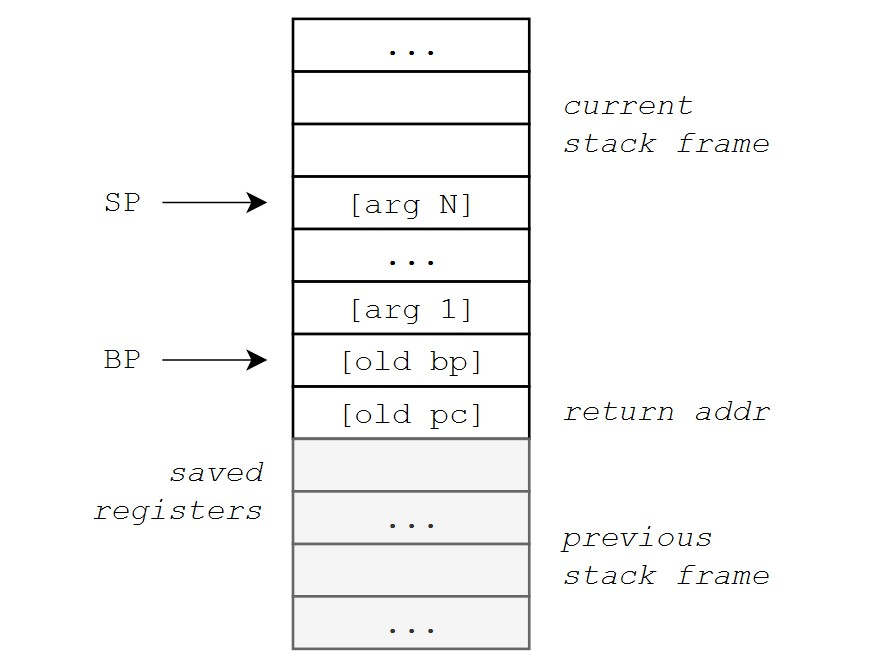
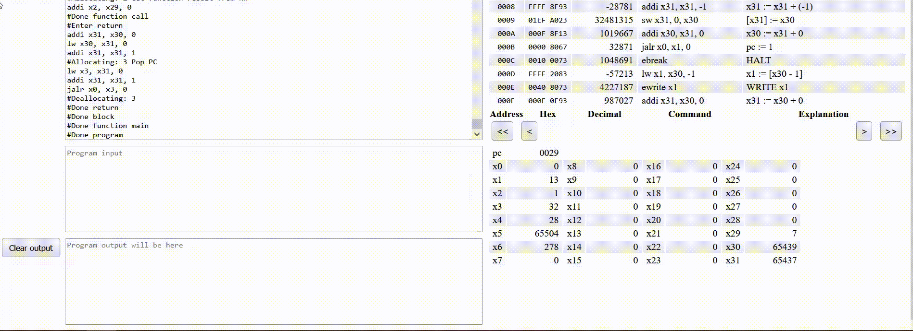

# FunC

`FunC` -- это простой компилируемый язык программирования с `C`-подобным синтаксисом.

## Структура программы

Программа является набором функций, среди которых обязательно должна быть функция с именем `main` -- точка входа. Для корректной работы каждая функция должна иметь оператор `return [<arg>];` с опциональным аргументом. 

Упрощенное описание грамматики языка (без определения терминальных символов, правил трансляции и приоритетов операндов) представлено ниже. Полный файл грамматики доступен [в репозитории](./src/codegen/parser.y).

```
program: functions

functions:
	  <empty>
	| functions function

function:
	func_res_type ID ( param_list ) block

param_list:
	  <empty>
	| params
params:
	  param
	| params ',' param
param:
	type ID


block:
	  <empty>
	| statement
	|'{' statements '}'

statements:
	statement
	| statements statement

statement:
	  type ID ';'
	| type ID '=' expr ';'
	| ID '=' expr ';'
	| expr '[' expr ']' '=' expr ';'
	| expr '(' arg_list ')' ';'
	| 'if' '(' expr ')' block
	| 'if' '(' expr ')' block 'else' block
	| 'while' '(' expr ')' block
	| 'return' ';'
	| 'return' expr ';'

expr:
	  expr BINOP expr
	| UNOP expr
	| LITERAL
	| ID
	| expr '(' arg_list ')'
	| expr '[' expr ']'
	| '(' expr ')'


args_list:
	  <empty>
	| args
args:
	  expr
	| args ',' expr


	
type: 
      INT_T 
    | BOOL_T 
    | STRING_T 
    | '(' func_type ')'
func_res_type:
      type 
    | VOID_T
func_type:  
      type '-' func_type_rec
    | VOID_T '-' func_res_type 
func_type_rec:
       type '-' func_type_rec 
    | func_res_type

```
 
## Типы

У `FunC` статическая сильная (строгая) типизация. Операторы применятся только к операндам одного типа. В языке представлено 4 базовых типа (с поддерживаемыми ими операторами):

- `int` -- целое число со знаком / символ Unicode;
  - `= | + | - | * | / | % | > | < | == | - <un>`
- `bool` -- логическое значение;
  - `= | || | && | ! <un> `
- `string` -- строка, ссылка на буфер в памяти;
  - `= | [<ind>] <un>`
- `(<func-type>)` -- функция, ссылка на код в памяти;
  - `= | (<args>) <un>`

  А также
- `void` -- псевдотип для пустого возвращаемого значения функции и для формирования типа функции с пустыми значением / без аргументов. 

На уровне грамматики `FunC` определено, что функции принимают либо аргументы базовых типов (один и более), либо не принимают аргументов вообще, и тип такой функции выглядит как `(void-<ret_type>)`.

## Функции

Рассмотрим упрощенный [пример с сортировкой вставками](./examples/sort.fc). 

```C
int regular_compare(int a, int b) { return a - b; }

int reverse_compare(int a, int b) { return b - a; }

int even_are_bigger_compare(int a, int b) {
  if (a % 2 == 0 && b % 2 != 0)
    return 1;
  if (a % 2 != 0 && b % 2 == 0)
    return -1;
  return a - b;
}

void insertion_sort(string arr, int n, (int - int - int)compare) {
  int i = 1;
  while (i < n) {
    int cur = arr[i];
    int j = i - 1;

    while ((j > 0 || j == 0) && (compare(arr[j], cur) > 0)) {
      arr[j + 1] = arr[j];
      j = j - 1;
    }
    arr[j + 1] = cur;
    i = i + 1;
  }
  return;
}


void main() {
  string s = "153462798";
  int len = 9;
  insertion_sort(s, len, regular_compare);          // 1 2 3 4 5 6 7 8 9 
  insertion_sort(s, len, reverse_compare);          // 9 8 7 6 5 4 3 2 1
  insertion_sort(s, len, even_are_bigger_compare);  // 1 3 5 7 9 2 4 6 8 
  return;
}
```

Этот пример призван проиллюстрировать передачу функций как аргументов определенного типа. Здесь тип компаратора -- `(int-int-int)`, а тип самой функции сортировки -- `(string-int-(int-int-int)-void)`.


## Встроенные функции

Операторы записи и чтения символов реализованы как встроенные функции `(int-void) write` и `(void-int) read`, обертки над вызовами инструкций `ewrite` и `eread`.

Эти функции добавляются неявно в самом начале любой программы и заносятся в таблицу символов.

Конечно, для реализации таких операторов более оптимальным решением было бы определение  их как ключевых слов, заменяемых при трансляции на нужные инструкции напрямую. Однако нам было интересно применить другой подход и подключить к программе маленькую стандартную библиотеку.

На работу с этими функциями можно посмотреть [в программе по вычислению факториала](./examples/factorial.fc).

## Переменные 

Переменные могут содержать любой базовый тип, в том числе и ссылки на функции. При объявлении переменной (а также при декларации функции) ее имя, тип, а также способ доступа к памяти (через стек или абсолютный адрес) сохраняются [в таблице символов](https://github.com/Dimankarp/func/blob/master/src/visitor/code_visitor.hpp#L22).


Таблица символов поддерживает блочную видимость:
```C
int a = 42;     // a = 42
while(a > 0){   // a = 42 и здесь, бесконечный цикл
  int a = -1;   // a = -1 только внутри блока
}
                // a = 42, код недостижим
```

## Работа с памятью

В `FunC` все переменные хранятся на стеке, чтобы поддерживать рекурсивные вызовы. Единственные переменные, доступ к которым осуществляется по абсолютному адресу, -- это объявленные функции (потому что с точки зрения таблицы символов объявленные функции -- это обычные переменные функционального типа в корневом блоке видимости, который никогда не очищается). 

Статического выделения памяти и динамической аллокации не предусмотрено.

## Регистры

- `x0` -- всегда содержит 0;
- `...` -- регистры общего назначения;
- `x29` -- регистр `RR`, необходим для возврата значения из функции;
- `x30` -- регистр `BP`, указывает на начало текущего кадра стека;
- `x31` -- регистр `SP`, указывает на вершину стека, последний добавленный элемент.

При компиляции за аллокацию регистров отвечает [`reg_allocator`](./src/visitor/register_allocator.hpp). Каждому регистру общего назначения сопоставлен флаг `занят`. Этот флаг выставляется при сохранении в регистре значения, вычисляемого в выражении, и сбрасывается, когда значение уже не используется и регистр можно переиспользовать. Для вычисления выражения должно хватать  28 регистров, иначе будет выброшено исключение `not_enough_registers_exceptions`.

## Функции: поток данных и управления

### Вызов функции

Вызов функции происходит в несколько этапов.

0. Сохранение регистров общего назначения;

Занятые регистры общего назначения кладутся на стек.

1. Инициализация нового стекового фрейма;

На стек кладется адрес возврата и `BP` текущего стекового фрейма. Далее `BP` обновляется так, чтобы указывать на новый стековый фрейм.

2. Передача аргументов;

На этом этапе на стек кладутся аргументы в порядке их объявления. Из самой функции к первому аргументу можно будет обратиться по адресу `BP - 1`, ко второму -- `BP - 2` и так далее.

3. Переход.

На третьем этапе происходит безусловный переход по адресу функции.

В результате, стек выглядит следующим образом:




### Возврат из функции

0. Сохранение результата в регистре `RR`;

1. Восстановление предыдущего стекового фрейма;
 - `SP <- BP`
 - `pop BP` -- `BP <- old BP`

2. Переход.
 - `PC <- pop ret_addr`

### Восстановление после вызова функции

Происходит на вызывающей стороне.

0. Восстановление регистров из стека;

1. Сохранение результат работы функции.

Так как возврат значения из функции происходит через единый `RR`, то для сохранения вернувшегося значения выделяется новый регистр. 


## Обход дерева

Обход дерева осуществляется при помощи [паттерна Visitor](./src/visitor/visitor.hpp).

Для удобства реализован [`print_visitor`](./src/visitor/print_visitor.cpp) вывода сформированного AST. Например, рассмотрим программу, которая модифицирует строку и выводит результат на экран:

```C
int strlen(string s){
    int len = 0;
    while(s[len] != 0)
        len = len + 1;
    len = len + 1;
    return len;
}

void write_str(string s, int len){
    int i = 0;
    while(i < len){
        write(s[i]);
        i = i + 1;
    }
    return;
}

void main(){
    string a = "i love Paris  in the morning";
    string b = "Moscow";
    int i = 7;
    while(i < strlen("Moscow") - 1 + 7){
        a[i] = b[i-7];
        i = i + 1;
    }
    write_str(a, strlen(a));
    return;
}

```

Выведем сформированное AST в кодо-подобном формате:

```
program:
   int strlen 
      string s
      {
         int len =
            0
         while
            !=
               0
         {
            len =
               +
                  len
                  1
         }
         len =
            +
               len
               1
         return
            len
      }
   void write_str 
      string s
      int len
      {
         int i =
            0
         while
            <
               i
               len
         {
            write
            i =
               +
                  i
                  1
         }
         return
      }
   int main 
      {
         string a =
            i love Paris  in the morning
         string b =
            Moscow
         int i =
            7
         while
            <
               i
               +
                  -
                     strlen
                        Moscow
                     1
                  7
         {
            i =
               +
                  i
                  1
         }
         write_str
            a
            -
               strlen
                  a
               1
         return
      }
```

Скомпилируем и запустим программу:

